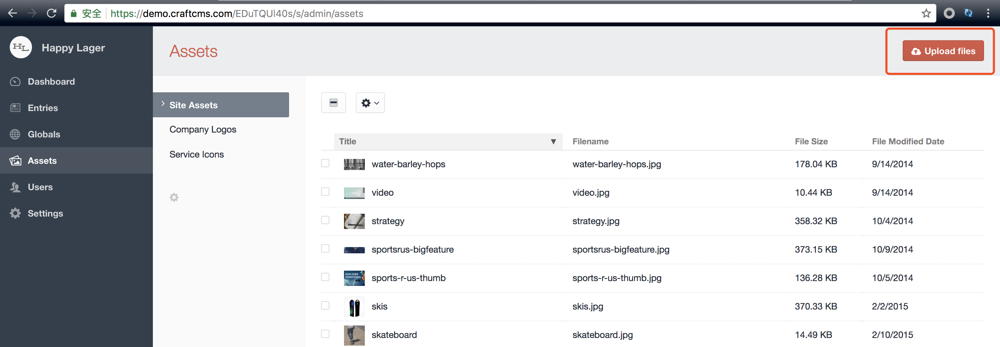
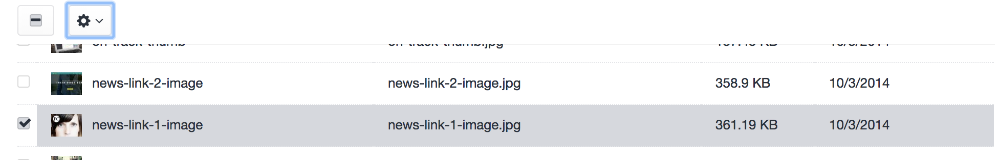
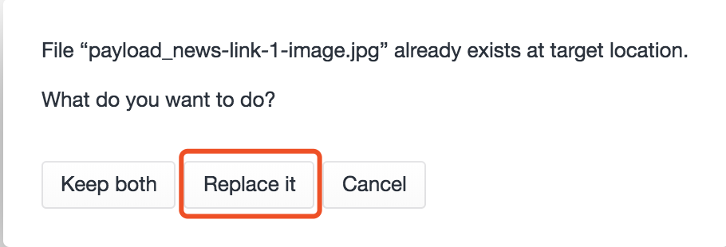
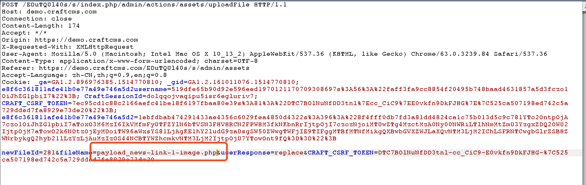

# Prepare
Get your very own Craft demo site in https://demo.craftcms.com/ (The site will automatically expire in 48 hours) or build local.

My poc site : 

https://demo.craftcms.com/EDuTQUl40s/s/assets/site/payload_news-link-1-image.php

 

# PoC
1.login the site

2.Go to "Assets->upload files"

3.Upload one picture to see how GD function reshape the picture. I just download the "news-link-1-image.jpg" which is already in the list.

4.Insert the `<?php phpinfo();?>` into the pic by using "jpg_payload.php"

  `php jpg_payload.php news-link-1-image.jpg`
  
  Then the new pic "payload_news-link-1-image.jpg" is created.
  
 5.Upload the "payload_news-link-1-image.jpg" ,now we can not change the filename by burpsuite.Then we upload the "payload_news-link-1-image.jpg" again,it will show up the warning as follow:
 
 
 
  We choose the "Replace it".
 
 6.Use burp to change the filename:
 
 
 
 7.Then view the php file:
  
  
# Reference:

http://0day5.com/archives/4122/

https://xianzhi.aliyun.com/forum/topic/416/

